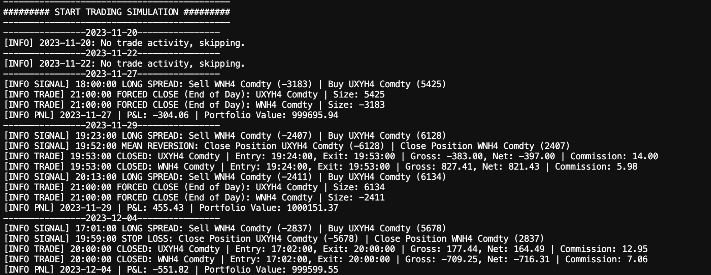

# Statistical-Arbitrage-Intraday-Trading

Implements a pairs trading strategy with intraday data, runs backtests using an OOP engine, and displays results with an interactive Dash app.


# Table of Contents

1. [Quickstart Guide](#quickstart-guide)
2. [File Structure Information](#file-structure-information)
3. [Statistical Analysis](#statistical-analysis)
4. [Trading Logic](#trading-logic)
5. [Dash App](#dash-app)
6. [Further Thoughts](#further-thoughts)


# Quickstart Guide

To get started, clone the repository and install the required packages:

```bash
$ git clone https://github.com/michaelacn/Statistical-Arbitrage-Intraday-Trading.git
$ cd Statistical-Arbitrage-Intraday-Trading
$ pip install -r requirements.txt
$ python3 main.py
```

Then, the code proceeds through three distinct steps:

### Step 1: Statistical Analysis


### Step 2: Strategy Backtesting



### Step 3: Visualization with the Dash App


# File Structure Information

### main.py
Manages strategy initialization, broker settings, backtesting, and Dash app visualization.

### config/
Customize strategy parameters, data paths, and settings via YAML configuration.

### lib/
Contains custom modules for the project, including strategy implementation, data preprocessing, statistical analysis, and Dash app components.

### md_resources/
Stores images used in the Markdown documentation to provide visual support and clarity.

### requirements.txt
A file listing all the necessary Python dependencies for the project.

### us_tnote_intraday_hlocv.csv
Contains intraday historical data for U.S. Treasury notes futures, covering one quarter.


# Statistical Analysis

### Flowchart for Finding Trading Dates

Each date, training data is assessed: ADF Test checks for non-stationarity, Order Specification determines VAR lag via BIC, Model Checking confirms fit with residuals, and Two-Step Model Selection picks the best VECM for trading.


### Cointegration Analysis

We perform a two-stage cointegration analysis to choose the best VECM among three options: Model 1 (no deterministic terms), Model 2 (constant in the cointegration equation), and Model 3 (constant in the error correction term). The first stage uses the Johansen trace test to identify eligible models, followed by a likelihood ratio test in the second stage to compare them.


# Trading Logic

### Spread Assumptions and Trade Signals

The spread is assumed normally distributed, with trading thresholds at ±1.96 standard deviations (2.5% and 97.5% quantiles). A trade triggers at these thresholds, closing upon mean reversion. A stop loss activates at three times ±1.96 standard deviations (structural break). All positions close at day’s end to avoid overnight trading.


The red, purple, and black lines represent the spread's mean, opening thresholds, and stop-loss thresholds. The orange and green curves show spread changes during the trading period. We long (short) the portfolio if the spread starts at A and moves down to E (up to B). Solid and dashed curves mark profit-taking (F or D) or stop-loss actions (C or H). The dotted curve shows a forced close at the period's end (G).

### Position Sizing

Positions are allocated by dividing the portfolio value between the two assets in the ratio of $1 / (1 + \beta)$ and $\beta / (1 + \beta)$. Position sizes are then determined by dividing these amounts by the current asset prices.

```python
def compute_sizes(self):
    beta = abs(self.p.beta)
    pf_val0 = 1 / (1 + beta) * self.broker.get_value()
    pf_val1 = beta / (1 + beta) * self.broker.get_value()
    size0 = int(pf_val0 / self.datas[0].close[0])
    size1 = int(pf_val1 / self.datas[1].close[0])
    return size0, size1
```


# Dash App

### Trades history

The first tab displays trade details and graphs for the selected date, highlighting long and short positions over time.


### Strategy performances

The second tab shows performance metrics, cumulative returns, drawdowns, and P&L of the strategy over time.


# Further Thoughts

Here are some potential extensions to consider:

- Analyze the impact of intraday signals on bid/ask spreads.
- Develop more sophisticated trading thresholds using Deep Learning techniques.
- Extend the framework to simultaneously handle multiple pairs.

# Bibliography

Ti, YW., Dai, TS., Wang, KL. et al. Improving Cointegration-Based Pairs Trading Strategy with Asymptotic Analyses and Convergence Rate Filters. Comput Econ (2024). https://doi.org/10.1007/s10614-023-10539-4
